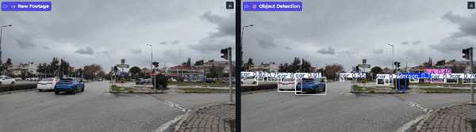

# JustCV - Urban Traffic Monitor 🚦


## 🚀 Live Demo

**Try it now - no installation required!**

[](https://huggingface.co/spaces/justgodtears/justcv)

Experience real-time object detection on urban traffic footage directly in your browser. Upload your own videos or watch the live demo with side-by-side comparison.

---

Real-time AI-powered traffic monitoring system using YOLOv8...

gitg
*Side-by-side comparison: Raw footage (left) vs Real-time detection (right)*

---

## 🎯 Features

- **Real-time Object Detection** - YOLOv8-powered detection of vehicles and pedestrians
- **Multi-class Recognition** - Identifies cars, buses, trucks, motorcycles, bicycles, and people
- **Video Processing Pipeline** - Frame-by-frame analysis with GPU acceleration
- **Interactive Web Interface** - Gradio-based UI for easy video upload and processing
- **Side-by-side Comparison** - Visualize raw footage alongside detection results
- **Object Counting** - Automatic counting and classification of detected objects

---

## 🛠️ Tech Stack

### Core Technologies
- **Python 3.13** - Programming language
- **YOLOv8 (Ultralytics)** - State-of-the-art object detection model
- **OpenCV** - Computer vision and video processing
- **PyTorch + CUDA** - GPU-accelerated deep learning inference

### Frameworks & Tools
- **Gradio** - Web interface framework
- **NumPy** - Numerical computing
- **Pillow** - Image processing utilities

---

## 📊 Detected Classes

The system detects and counts the following urban traffic objects:

| Object | Description |
|--------|-------------|
| 🚶 Pedestrians | People walking or standing |
| 🚗 Cars | Personal vehicles |
| 🚌 Buses | Public transport vehicles |
| 🚚 Trucks | Commercial/cargo vehicles |
| 🏍️ Motorcycles | Two-wheeled motorized vehicles |
| 🚴 Bicycles | Non-motorized two-wheelers |

*Note: Traffic lights are intentionally excluded from detection for focused traffic analysis.*

---

## 🚀 Quick Start

### Option 1: Try Online (Recommended)

**No setup required!** Visit the live demo:

👉 **[JustCV on Hugging Face Spaces](https://huggingface.co/spaces/justgodtears/justcv)**

- Upload your traffic videos
- See real-time object detection
- Side-by-side comparison view

---

### Option 2: Local Installation

### Prerequisites

- Python 3.13+
- NVIDIA GPU with CUDA support (optional, but recommended)
- 4GB+ RAM

### Installation

1. **Clone the repository**
```bash
git clone https://github.com/justgodtears/JustCV.git
cd JustCV
```

2. **Create virtual environment**
```bash
python -m venv .venv
.venv\Scripts\activate  # Windows
# source .venv/bin/activate  # Linux/Mac
```

3. **Install dependencies**
```bash
# Install PyTorch with CUDA support
pip install torch torchvision torchaudio --index-url https://download.pytorch.org/whl/cu126

# Install other dependencies
pip install ultralytics opencv-python gradio numpy pillow
```

4. **Download YOLOv8 model** (automatic on first run)
```bash
# Model will be downloaded to models/yolov8m.pt automatically
```

---

## 💻 Usage

### Web Interface (Recommended)

Launch the Gradio web interface:
```bash
python app.py
```

Then open your browser to `http://localhost:7860`

**Features:**
- **Live Demo Tab** - View pre-processed demo with side-by-side comparison
- **Process Your Video Tab** - Upload and process custom traffic videos
- **About Tab** - Project documentation and technical details

### Programmatic Usage

#### Image Detection
```python
from src.core.image_detector import ObjectDetection

# Initialize detector
detector = ObjectDetection("models/yolov8m.pt")

# Detect objects
results = detector.detect("path/to/image.jpg")

# Count objects by class
counts = detector.count_objects(results)
print(f"Detected: {counts}")

# Save annotated image
detector.save_annotated(results, "output.jpg")
```

#### Video Processing
```python
from src.core.video_processor import VideoProcessor
from src.core.image_detector import ObjectDetection

# Initialize
detector = ObjectDetection("models/yolov8m.pt")
processor = VideoProcessor(detector)

# Process video
processor.process_video(
    input_path="input.mp4",
    output_path="output.mp4"
)
```

---

## 📁 Project Structure
```
JustCV/
├── src/
│   ├── core/
│   │   ├── image_detector.py    # Object detection class
│   │   └── video_processor.py   # Video processing pipeline
│   └── config.py                # Project configuration
├── demo/
│   ├── traffic.mp4              # Demo raw footage
│   └── output_video.mp4         # Demo processed video
├── models/                      # YOLOv8 model weights
├── tests/                       # Test scripts
├── app.py                       # Gradio web interface
├── requirements.txt             # Python dependencies
└── README.md
```

---

## 🎓 Project Background

JustCV was developed as a portfolio project to demonstrate:

- **Computer Vision Pipeline Development** - Building production-ready CV systems
- **Deep Learning Model Deployment** - Implementing YOLO for real-world applications
- **Real-time Video Processing** - Handling continuous video streams efficiently
- **Clean Code Architecture** - Following software engineering best practices

### Learning Outcomes

- YOLOv8 implementation and optimization
- OpenCV video processing techniques
- GPU-accelerated inference with PyTorch
- Web interface development with Gradio
- Object tracking and counting algorithms

---

## 🔧 Performance

### Hardware Tested

- **GPU**: NVIDIA RTX 3060 (12GB VRAM)
- **CPU**: Intel Core i7 (fallback)
- **RAM**: 16GB

### Benchmarks

| Resolution | Model | FPS (GPU) | FPS (CPU) |
|------------|-------|-----------|-----------|
| 1280x720   | YOLOv8m | ~100 | ~5 |
| 1920x1080  | YOLOv8m | ~60 | ~2 |
| 3840x2160  | YOLOv8m | ~15 | <1 |

*Note: Performance varies based on scene complexity and number of objects.*

---

## 🚧 Known Limitations

- Traffic light detection is disabled by design
- Performance degrades significantly without GPU
- Large video files (>1GB) may require significant processing time
- Model trained on COCO dataset (general objects, not traffic-specific)

---

## 🔮 Future Enhancements

- [ ] Live stream support from IP cameras
- [ ] Traffic flow analytics and heatmaps
- [ ] Multi-camera support with synchronized detection
- [ ] Custom training on traffic-specific datasets
- [ ] Export detection data to CSV/JSON
- [ ] Real-time counting dashboard with statistics

---

## 🌐 Deployment

This project is deployed on Hugging Face Spaces for easy access and demonstration.

**Live Application:** [https://huggingface.co/spaces/justgodtears/justcv](https://huggingface.co/spaces/justgodtears/justcv)

### Deploy Your Own

Want to deploy your own version?

1. Fork this repository
2. Create a [Hugging Face Space](https://huggingface.co/new-space)
3. Select **Gradio SDK**
4. Connect to your GitHub repo
5. Your app will be live in minutes!


---

## 📝 Citation

This project uses YOLOv8 from Ultralytics. If you use this work, please cite:
```bibtex
@software{yolov8_ultralytics,
  author = {Glenn Jocher and Ayush Chaurasia and Jing Qiu},
  title = {Ultralytics YOLOv8},
  version = {8.0.0},
  year = {2023},
  url = {https://github.com/ultralytics/ultralytics},
  license = {AGPL-3.0}
}
```

---

## 📄 License

This project is licensed under the MIT License - see the [LICENSE](LICENSE) file for details.

**Note:** YOLOv8 is licensed under AGPL-3.0. Commercial use may require a separate license from Ultralytics.

---

## 👤 Author

**Oliwier Opyrchal**

- GitHub: [@justgodtears](https://github.com/justgodtears)
- LinkedIn: [Oliwier Opyrchal](https://pl.linkedin.com/in/oliwier-opyrchal)
- Portfolio: [JustCV](https://github.com/justgodtears/JustCV)
-  Live Demo: [JustCV on HF Spaces](https://huggingface.co/spaces/justgodtears/justcv)

---

## 🙏 Acknowledgments

- [Ultralytics](https://github.com/ultralytics/ultralytics) for YOLOv8
- [OpenCV](https://opencv.org/) for computer vision tools
- [Gradio](https://gradio.app/) for the web interface framework
- Urban traffic footage from public sources

---

<div align="center">

**Built with ❤️ for urban traffic analysis**

⭐ Star this repo if you find it useful!

</div>